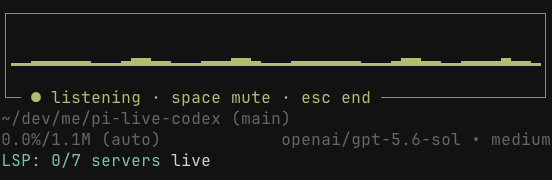

# pi-extensions

Personal extensions for the [Pi coding agent](https://pi.dev).

## Colima sandbox

`bin/pi-sandbox` is an opt-in launcher for running Pi's built-in filesystem and shell tools in one disposable Colima container while Pi and model authentication remain on the host. Run it from the root of a normal (non-linked-worktree) Git checkout:

```sh
~/dev/me/pi-extensions/bin/pi-sandbox --
~/dev/me/pi-extensions/bin/pi-sandbox -- --model gpt-5 --thinking high
~/dev/me/pi-extensions/bin/pi-sandbox -- --print "inspect the tests"
```

The launcher requires Docker's explicit `colima` context and a trusted DCG extension at `~/.dotfiles/ai/pi/extensions/dcg-guard.ts`. It creates a fresh labeled container, mounts only the canonical current directory read-write at `/workspace`, and removes the container on exit or signal. The default guest network is `none`; opt into the Docker bridge network explicitly before the separator:

```sh
~/dev/me/pi-extensions/bin/pi-sandbox --network=unrestricted --
```

Only safe model/session arguments are forwarded. Extensions, approval, tool-selection, context/resource-loading, custom system-prompt, export, and other host-surface options are rejected. Pi is started with no extension discovery, no project approval, no skills, no prompt templates, no context files, and no themes; it explicitly loads only the trusted DCG extension and `extensions/colima-sandbox/index.ts`, with `read,bash,edit,write,grep,find,ls` active. There is no sandbox disable switch.

Threat boundary and limitations: the workspace is intentionally read-write, and commands run as a non-root user with a read-only container root, no host environment/credentials/home/SSH agent/Docker socket, dropped capabilities, no-new-privileges, bounded resources, and a sanitized guest environment. Docker/Colima and the Pi host remain trusted; a Colima VM or Docker escape remains a residual risk. Linked Git worktrees, launches below the repository root, and workspaces containing either host-loaded sandbox extension are rejected for the MVP. Custom, MCP, subagent, project extensions/resources, and other additional tools are not supported. Non-running stale containers are swept on the next launch; after a hard host crash, remove any still-running `io.pi.colima-sandbox=true` container manually after confirming no sandbox session owns it.

The interactive `/sandbox` command reports only the container, resolved image ID, mount, network, and boundary. The image is built from the deterministic repository Dockerfile and contains Bash, Git, ripgrep, and Node.


### Live Codex

Realtime `gpt-live-1-codex` voice mode. Speak naturally; repository work is delegated to the active Pi session and results are read back.



Start Pi in its interactive TUI, then run:

```text
/live
```

Use `/live <voice>` to select a voice. `Ctrl+L` toggles voice mode, `Space` mutes, and `Esc` ends the session. Drop image files into the terminal while live to attach them to your next spoken request.

Requires Node.js 22.19+, microphone access, and an OpenAI Codex login (`/login openai-codex`). Only one Pi process can use live voice at a time.

### Title

Generates a concise session title once, after the first completed user/assistant exchange. The title is persisted as the Pi session name and used verbatim as the terminal title. Existing and manually named sessions are left unchanged.

Global configuration lives at `~/.pi/agent/pi-title.json` (or under `PI_CODING_AGENT_DIR`):

```json
{
  "enabled": true,
  "model": null,
  "maxTokens": 30,
  "maxLength": 60
}
```

By default, an omitted or `null` model uses the active session model. Set `"model": "auto"` to use an available lightweight model, or set an explicit `provider/model[:effort]` reference.

Commands:

```text
/title                                   Show the current title, status, and config path
/title My custom title                   Set a custom title
/title set status                        Set a custom title that matches a subcommand
/title on                                Enable automatic titles
/title off                               Disable automatic titles
/title model openai/gpt-5-nano           Select a dedicated title model
/title model auto                        Use the lightweight-model fallback
/title model active                      Use the active session model
/title regenerate                        Replace the current title automatically
```

## Install

Install both extensions from the repository:

```sh
pi install git:github.com/brettinternet/pi-extensions
```

Or install only Live Codex from npm:

```sh
pi install npm:pi-live-codex
```

Installed extensions are loaded from their package metadata.

## Development

```sh
bun install
bun run check
bun test
pi -e .
```
